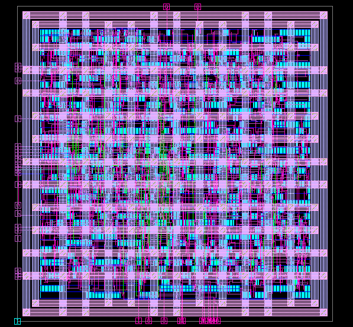

# ASIC Design Project: I2C Master Core

This project demonstrates the complete ASIC design flow for an I2C Master Core communication protocol using the Synopsys EDA suite of tools.
## Final Routed Chip

## Introduction

The Inter-Integrated Circuit (I2C) bus is a widely used serial communication protocol for embedded systems, enabling low-power, bidirectional communication between a master device and multiple slave devices. I2C Master Cores are crucial components that initiate and control data transfers on the I2C bus.

The objective of this project was to design and implement a functional I2C Master Core capable of achieving high communication speeds. The Synopsys EDA suite, including Design Compiler, Formality, IC Compiler 2, and PrimeTime, was utilized throughout the various stages of the design flow, encompassing synthesis, verification, and physical design. 

The final implementation achieved a successful clock frequency of 550 MHz, exceeding the initial target based on I2C specifications. This README provides an overview of the design methodology and key achievements of the project.

## Repository Contents

- **I2C_RTL_Codes:** Contains RTL code files for the I2C Master Core.
- **Scripts:** Includes scripts used for synthesis, verification, and physical design stages.
- **Screenshots:** Contains screenshots of synthesis, placement, routing, timing analysis results, and different reports like Qor, area, cells, etc.

## Methodology

### Design Specifications and Requirements

The project team prioritized achieving high communication speed over other metrics. For optimization over frequency, a proper library/technology was chosen: SAED90nm max lth, which offers faster transistors due to lower temperature, typical voltage supply, and slow process corner.

### Tools and Technologies

The entire ASIC design flow for the I2C Master Core utilized the Synopsys EDA suite:
- Design Compiler: Logic synthesis with SAED90nm max lth library.
- Formality: Ensured functional equivalence between RTL code and synthesized netlist.
- IC Compiler 2: Handled physical design stages, including placement and routing.
- PrimeTime: Performed static timing analysis to verify signal propagation times.

## Front-End ASIC Design Flow

The front-end design flow started with RTL design and specification, followed by logic synthesis and optimization. The focus was on balancing performance, area, and power consumption.

## Back-End ASIC Design Flow - PnR

The back-end design flow involved converting RTL netlist to GDSII using IC Compiler. Floor planning, power planning, placement, clock tree synthesis (CTS), routing, filler cell insertion, and static timing analysis (STA) were performed to achieve optimization in physical design, power consumption, and high performance.

## Testing Configuration with VS Code

## Conclusion

This project successfully implemented the complete ASIC design flow for an I2C Master Core, achieving high communication speed and meeting project objectives. Key achievements include RTL to GDSII flow, physical design optimization, power optimization, and achieving high performance within the targeted area.

## License

This project is licensed under the MIT License. See the [LICENSE](LICENSE) file for details.
